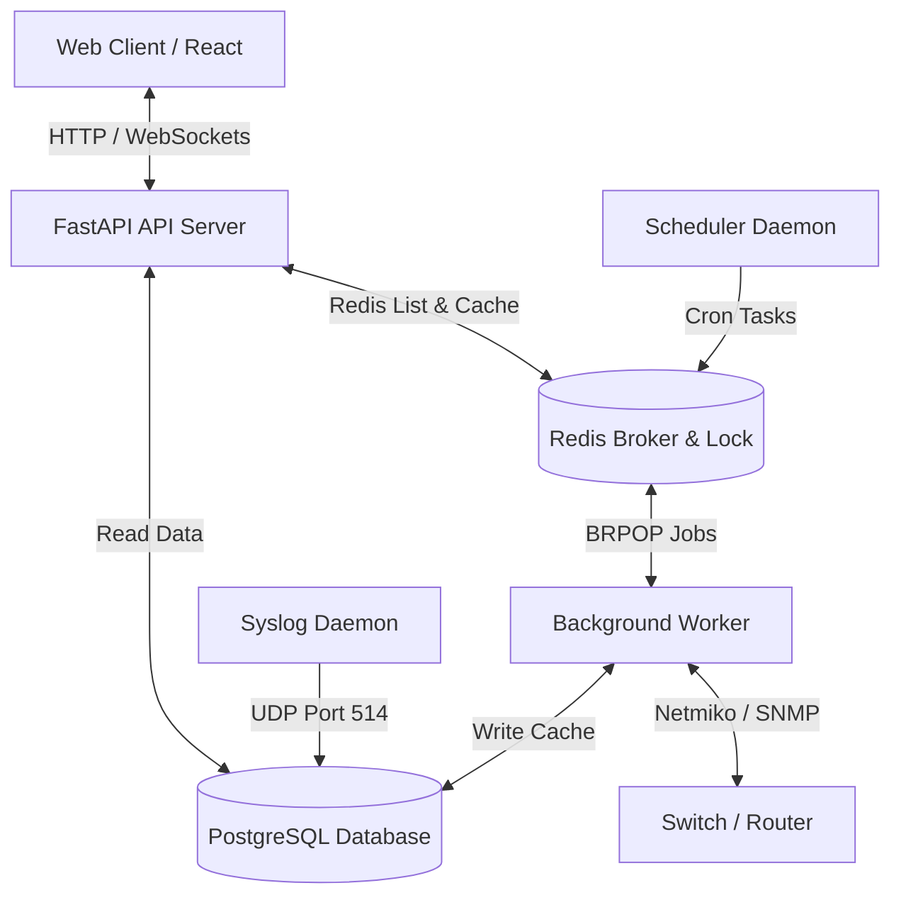

# NetX - Network Management Platform

NetX adalah platform manajemen, pemantauan, dan otomatisasi jaringan *enterprise-grade* modern. Aplikasi ini dirancang untuk memetakan port fisik switch (Port Mapping), melacak perangkat terhubung (MAC & IP), memvisualisasikan topologi jaringan secara interaktif, mengelola pencadangan konfigurasi otomatis, serta mendeteksi anomali performa secara real-time.

---

## 🚀 Fitur Utama

*   **Switch Faceplate Visualization**: Representasi visual port fisik switch secara real-time (aktif, mati, uplink, dll.) lengkap dengan informasi klien (vendor, jenis perangkat, IP/MAC).
*   **Interactive Topology**: Peta topologi jaringan dinamis berbasis LLDP/CDP dengan penyimpanan tata letak node interaktif.
*   **Redis-Based Distributed Queue**: Pemisahan tugas API dan pemrosesan latar belakang yang berat (SSH, SNMP, Backup) menggunakan antrean Redis asinkron untuk kestabilan tinggi.
*   **Automatic Configuration Backup**: Pencadangan berkala konfigurasi perangkat (*running-config*) dilengkapi dengan fitur *Config Diff Viewer*.
*   **Layer 2 Monitoring**: Pemantauan detail status Spanning Tree Protocol (STP) dan database VLAN langsung via SNMP.
*   **Advanced Anomaly Detection**: Deteksi dini badai paket (Storm), port flapping, MAC flapping, dan STP topology changes.
*   **Syslog Engine**: UDP Syslog Receiver dengan fitur pengelompokan pola log (Clustering), pemfilteran, dan deteksi lonjakan log (Spike).
*   **Web CLI (Terminal SSH)**: Terminal interaktif aman berbasis WebSocket untuk akses konsol langsung dari browser.

---

## 🛠️ Tech Stack

*   **Frontend**: React, Vite, TypeScript, TailwindCSS/Vanilla CSS, React Flow / SVG.
*   **Backend**: FastAPI (Python 3.11+), Netmiko, PySNMP, Paramiko.
*   **Database & Queue**: PostgreSQL (Database Utama), Redis (Message Broker & Distributed Lock).
*   **Kontainerisasi**: Docker, Docker Compose.

---

## 📐 Arsitektur Sistem

Arsitektur sistem terdistribusi NetX memisahkan tugas server web dan pemrosesan intensif menggunakan antrean Redis asinkron:



---

## ⚡ Cara Menjalankan Aplikasi

### Persyaratan Utama
*   **Docker Desktop** (aktif di latar belakang)
*   **Node.js & npm** (versi 18+)

### Metode A: Startup Satu-Klik (Windows)
Cukup klik ganda berkas **`Start-NetX-Docker.bat`** di direktori root. Berkas ini akan otomatis menyalakan Docker Compose, membersihkan port, menjalankan server frontend di jendela terpisah, dan membuka browser Anda ke **`http://localhost:5173/`**.

### Metode B: Startup Manual via Terminal
1.  **Jalankan Backend (Docker Compose)**:
    ```bash
    docker compose up --build -d
    ```
2.  **Jalankan Frontend (Vite Host)**:
    ```bash
    cd frontend
    npm install
    npm run dev
    ```
3.  Buka browser dan kunjungi **`http://localhost:5173/`**.

### Kredensial Login Default
*   **Username**: `admin` (atau gunakan akun personal Anda jika sudah memulihkan database)
*   **Password**: `netx@admin`

---

## 📂 Dokumentasi Lebih Lanjut

Untuk panduan yang lebih terperinci, silakan buka dokumen di dalam folder `docs/`:
1.  **[Panduan Instalasi & Penggunaan](file:///c:/Code/Auto/NetX/docs/installation_and_usage_guide.md)**: Petunjuk konfigurasi lengkap, migrasi database, dan pemecahan masalah (troubleshooting).
2.  **[Dokumentasi Teknis](file:///c:/Code/Auto/NetX/docs/technical_documentation.md)**: Detail mengenai mekanisme parser switch, korelasi anomali (RCA), syslog clustering, dan integrasi SNMP.
3.  **[Panduan Konfigurasi Syslog & SNMP Switch](file:///c:/Code/Auto/NetX/docs/syslog_and_snmp_configuration_guide.md)**: Contoh perintah CLI untuk mengarahkan SNMP OID dan Syslog dari switch Cisco/Allied Telesis/Juniper ke server NetX.
