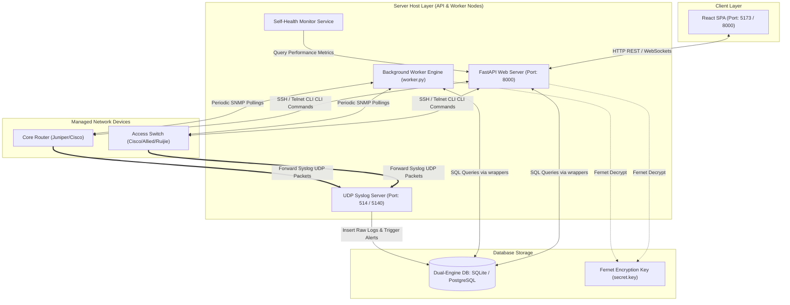
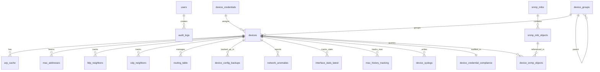
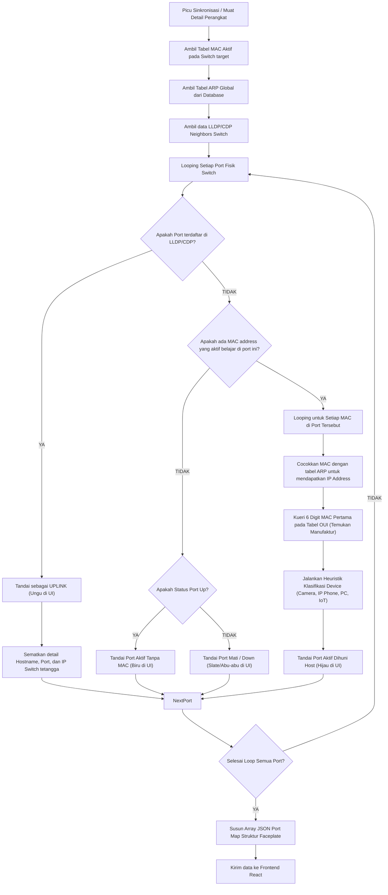
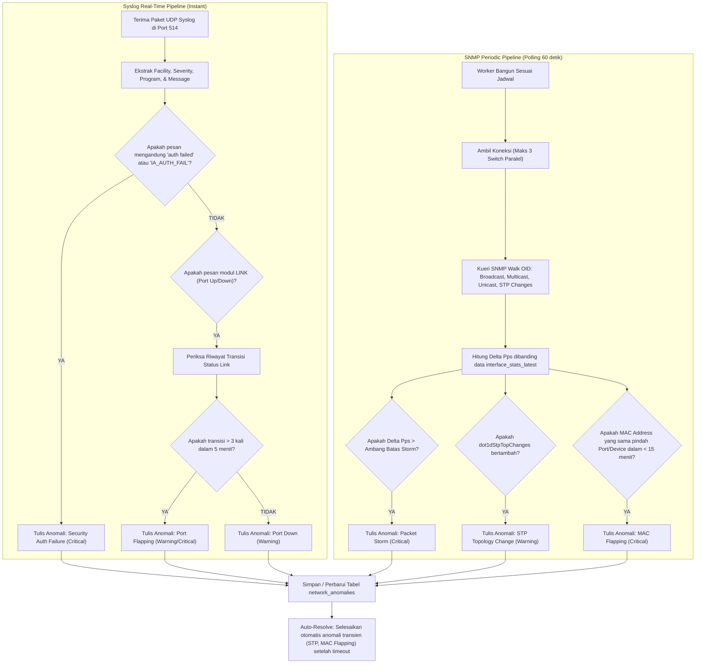
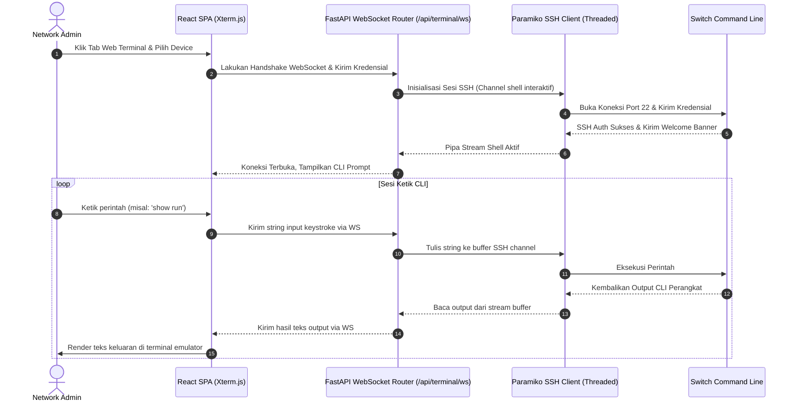

# Panduan Referensi Sistem NetX (Network Management Platform)

Dokumen ini menyediakan spesifikasi arsitektur teknis, skema basis data terperinci, alur pemrosesan data (visualisasi Mermaid), panduan penggunaan fitur lengkap, serta rekomendasi taktik adopsi guna memaksimalkan performa dan pemantauan infrastruktur jaringan menggunakan **NetX**.

---

## 1. Detail Infrastruktur & Arsitektur Sistem

Platform NetX dibangun dengan memisahkan modul-modul API, pemrosesan CLI perangkat, pemicu log, serta mesin polling berbasis SNMP. Berikut adalah komponen pembentuk infrastruktur NetX secara menyeluruh:

### A. Pola Hubungan Client-Server
*   **React SPA (Frontend)**: Berjalan di atas runtime browser, dibangun menggunakan Vite + React + Vanilla CSS. Frontend berinteraksi dengan backend melalui REST API JSON yang diamankan dengan token JWT, serta koneksi WebSockets real-time untuk emulasi terminal SSH.
*   **FastAPI (Backend)**: Berjalan di atas Python 3.10+, FastAPI bertindak sebagai penyaji API berspesifikasi OpenAPI/Swagger (dapat diakses di `/api/docs`).

### B. Mode Eksekusi Dual-Process (Unified vs. Worker-Separated)
NetX dirancang fleksibel agar dapat disesuaikan dengan skala infrastruktur jaringan:
1.  **Mode Unified (Bawaan)**: 
    *   API FastAPI dan seluruh background task dijalankan di dalam **satu proses tunggal** (diatur melalui `NETX_MODE=unified`).
    *   Cocok untuk deployment lokal, demo, atau jaringan skala kecil (< 10 perangkat).
2.  **Mode Worker-Separated (Produksi)**:
    *   **Proses API-Only**: Server FastAPI dijalankan dalam mode API dengan menonaktifkan background job scheduler (diatur dengan `NETX_MODE=api`).
    *   **Proses Worker-Only (`worker.py`)**: Proses terpisah yang didedikasikan untuk mengeksekusi seluruh kueri terjadwal dan daemon server Syslog.
    *   Mencegah duplikasi proses background, meningkatkan skalabilitas, dan menjaga API tetap responsif meskipun backend sedang melakukan backup konfigurasi switch massal.

### C. Mesin Eksekusi CLI Asinkron (Async Thread-Pool)
Karena pustaka koneksi SSH/Telnet Netmiko bersifat sinkron (blocking), NetX mengisolasi setiap proses login dan pengambilan teks CLI perangkat ke dalam Thread Pool menggunakan `asyncio.to_thread`. Hal ini memastikan event loop asinkron FastAPI tidak terblokir saat menunggu response terminal dari switch.

### D. Server Syslog UDP Terintegrasi
Mesin syslog NetX mendengarkan trafik paket UDP pada port standar **514** (atau **5140** jika hak akses terbatas). Server ini memproses log RFC 3164 secara langsung, mengekstrak IP pengirim, dan menyebarkan alert secara instan tanpa perlu menunggu siklus polling terjadwal.

### E. Driver Kompatibilitas Basis Data Ganda (Dual-Engine Wrapper)
Melalui [database.py](file:///c:/Code/Auto/NetX/backend/app/database.py), NetX menyediakan adapter transparan di runtime:
*   **SQLite Cursor Wrapper**: Mengukur latensi kueri dan menerapkan mode WAL (Write-Ahead Logging) secara otomatis.
*   **PostgreSQL Cursor Wrapper**: Menerjemahkan otomatis placeholder sintaks `?` menjadi `%s`, menghapus collation `COLLATE NOCASE`, mengubah pencarian `LIKE` menjadi `ILIKE` (case-insensitive), serta menulis ulang kueri SQLite `INSERT OR REPLACE` ke klausa native PostgreSQL `ON CONFLICT (...) DO UPDATE` (UPSERT).

---

## 2. Skema & Model Basis Data Lengkap

NetX mendukung SQLite (`netx.db` lokal) dan PostgreSQL (produksi terdistribusi). Berikut adalah detail lengkap dari **36 tabel** yang menyusun basis data NetX:

### A. Tabel Autentikasi & Pengguna

#### 1. `users`
Menyimpan profil pengguna yang dapat mengakses Web UI NetX.
*   **Primary Key**: `id` (SERIAL / INTEGER AUTOINCREMENT)
*   **Kolom**:
    *   `username` (VARCHAR(255) / TEXT, UNIQUE, NOT NULL): Nama pengguna untuk login.
    *   `password` (TEXT, NOT NULL): Hash password menggunakan bcrypt (`$2b$`).
    *   `full_name` (VARCHAR(255) / TEXT, DEFAULT ''): Nama lengkap pengguna.
    *   `role` (VARCHAR(50) / TEXT, NOT NULL, DEFAULT 'user'): Peran sistem (`admin` / `user`).
    *   `is_active` (INTEGER, NOT NULL, DEFAULT 1): Status aktif pengguna (1=Aktif, 0=Nonaktif).
    *   `created_at` (VARCHAR(100) / TEXT, NOT NULL): Timestamp pembuatan profil (format ISO).

#### 2. `audit_logs`
Mencatat aksi administratif yang dipicu oleh pengguna untuk pelacakan kepatuhan (compliance).
*   **Primary Key**: `id` (SERIAL / INTEGER AUTOINCREMENT)
*   **Foreign Key**: `user_id` -> `users(id)` ON DELETE SET NULL
*   **Kolom**:
    *   `username` (VARCHAR(255) / TEXT, NOT NULL): Nama pengguna yang melakukan aksi.
    *   `action` (TEXT, NOT NULL): Kategori aksi (misalnya: `DEVICE_ADD`, `BACKUP_TRIGGERED`, `USER_LOGIN`).
    *   `target` (VARCHAR(255) / TEXT, NOT NULL): Target objek yang dimodifikasi (misal: IP Device atau Username).
    *   `details` (TEXT, DEFAULT ''): Deskripsi tambahan tentang perubahan konfigurasi/aksi.
    *   `timestamp` (VARCHAR(100) / TEXT, NOT NULL): Waktu aksi dilakukan.

### B. Tabel Manajemen Perangkat & Kredensial

#### 3. `device_groups`
Menyusun hierarki pengelompokan perangkat jaringan dalam format tree.
*   **Primary Key**: `id` (SERIAL / INTEGER AUTOINCREMENT)
*   **Foreign Key**: `parent_id` -> `device_groups(id)` ON DELETE SET NULL (Referensial mandiri untuk struktur bersarang/nested).
*   **Kolom**:
    *   `name` (VARCHAR(255) / TEXT, UNIQUE, NOT NULL): Nama grup (misal: `Gedung-A`, `Lantai-1`).
    *   `description` (TEXT, DEFAULT ''): Keterangan grup.
    *   `created_at` (VARCHAR(100) / TEXT, NOT NULL): Waktu pembuatan grup.

#### 4. `device_credentials`
Menyimpan kredensial login SSH/Telnet global secara aman.
*   **Primary Key**: `id` (SERIAL / INTEGER AUTOINCREMENT)
*   **Kolom**:
    *   `name` (VARCHAR(255) / TEXT, UNIQUE, NOT NULL): Nama unik profil kredensial (misal: `SSH_Switch_Access`).
    *   `username` (VARCHAR(255) / TEXT, NOT NULL): Username login perangkat.
    *   `password` (TEXT, NOT NULL): Kata sandi terenkripsi simetris menggunakan algoritma **Fernet (cryptography)**.
    *   `created_at` (VARCHAR(100) / TEXT, NOT NULL): Waktu pendaftaran kredensial.

#### 5. `devices`
Tabel utama penyimpanan identitas seluruh perangkat switch/router yang dikelola.
*   **Primary Key**: `id` (SERIAL / INTEGER AUTOINCREMENT)
*   **Foreign Keys**:
    *   `group_id` -> `device_groups(id)` ON DELETE SET NULL
    *   `credential_id` -> `device_credentials(id)` ON DELETE SET NULL
*   **Indeks**:
    *   `idx_devices_ip` ON `devices(ip)`
    *   `idx_devices_group` ON `devices(group_id)`
*   **Kolom**:
    *   `name` (VARCHAR(255) / TEXT, UNIQUE, NOT NULL): Nama host perangkat.
    *   `ip` (VARCHAR(100) / TEXT, UNIQUE, NOT NULL): Alamat IP management.
    *   `protocol` (VARCHAR(50) / TEXT, NOT NULL, DEFAULT 'ssh'): Protokol koneksi (`ssh` / `telnet`).
    *   `port` (INTEGER, DEFAULT 22): Port koneksi.
    *   `username` (VARCHAR(255) / TEXT, DEFAULT ''): Custom username (jika tidak menggunakan profil kredensial).
    *   `password` (TEXT, DEFAULT ''): Custom password terenkripsi Fernet (jika tidak menggunakan profil kredensial).
    *   `device_type` (VARCHAR(100) / TEXT, NOT NULL, DEFAULT 'cisco_ios'): Driver vendor OS (misal: `cisco_ios`, `allied_telesis_awplus`, `juniper_junos`, `ruijie_os`).
    *   `description` (TEXT, DEFAULT ''): Informasi deskriptif perangkat.
    *   `status` (VARCHAR(50) / TEXT, DEFAULT 'unknown'): Status jangkauan perangkat (`online`, `offline`, `unknown`).
    *   `last_seen` (VARCHAR(100) / TEXT): Waktu terakhir perangkat berhasil dihubungi.
    *   `custom_arp_cmd` / `custom_lldp_cmd` / `custom_cdp_cmd` / `custom_routing_cmd` / `custom_info_cmd` (TEXT, DEFAULT ''): Kustomisasi kueri CLI manual jika parser vendor membutuhkan penyesuaian output.
    *   `snmp_version` (VARCHAR(50) / TEXT, DEFAULT 'v2c'): Versi SNMP (`v1` / `v2c` / `v3`).
    *   `snmp_community` (VARCHAR(255) / TEXT, DEFAULT 'public'): Community string SNMP read-only.
    *   `os_version` (VARCHAR(255) / TEXT, DEFAULT ''): Versi firmware/OS perangkat hasil deteksi kueri.
    *   `serial_number` (VARCHAR(255) / TEXT, DEFAULT ''): Nomor seri fisik sasis perangkat.
    *   `mac_address` (VARCHAR(255) / TEXT, DEFAULT ''): MAC Address base sasis perangkat.
    *   `hardware_model` (VARCHAR(255) / TEXT, DEFAULT ''): Seri model hardware.
    *   `raw_info` (TEXT, DEFAULT ''): Log mentah output deteksi sasis.
    *   `device_role` (VARCHAR(100) / TEXT, DEFAULT 'Access Switch'): Peran switch (`Core Switch`, `Distribution Switch`, `Access Switch`).
    *   `created_at` (VARCHAR(100) / TEXT, NOT NULL): Waktu pembuatan perangkat.

### C. Tabel Cache Hasil Scanning (Topology & Port Mapping)

#### 6. `arp_cache`
Menyimpan tabel ARP (resolusi IP-ke-MAC) perangkat untuk mencocokkan identitas host.
*   **Primary Key**: `id` (SERIAL / INTEGER AUTOINCREMENT)
*   **Foreign Key**: `device_id` -> `devices(id)` ON DELETE CASCADE
*   **Indeks**: `idx_arp_cache_device` ON `arp_cache(device_id)`
*   **Kolom**:
    *   `ip_address` (VARCHAR(100) / TEXT, NOT NULL): Alamat IP klien terdeteksi.
    *   `mac_address` (VARCHAR(100) / TEXT, NOT NULL): Alamat MAC klien terdeteksi.
    *   `interface` (VARCHAR(100) / TEXT, DEFAULT ''): Nama interface logical/virtual (misal: `Vlan1150`).
    *   `entry_type` (VARCHAR(50) / TEXT, DEFAULT 'dynamic'): Karakter entri ARP (`static` / `dynamic`).
    *   `age_minutes` (INTEGER, DEFAULT 0): Durasi keaktifan entri.
    *   `mac_vendor` (VARCHAR(255) / TEXT, DEFAULT ''): Nama manufaktur manufaktur berbasis lookup OUI (misal: `Dell Inc.`).
    *   `device_category` (VARCHAR(100) / TEXT, DEFAULT 'unknown'): Kategori perangkat hasil klasifikasi heuristik.
    *   `device_hint` (TEXT, DEFAULT ''): Informasi detail klasifikasi (misal: `IP Phone (Yealink)`).
    *   `fetched_at` (VARCHAR(100) / TEXT, NOT NULL): Waktu pengambilan data.

#### 7. `mac_addresses`
Menyimpan tabel MAC address yang dipelajari pada port fisik switch (`show mac address-table`).
*   **Primary Key**: `id` (SERIAL / INTEGER AUTOINCREMENT)
*   **Foreign Key**: `device_id` -> `devices(id)` ON DELETE CASCADE
*   **Indeks**: `idx_mac_addresses_device` ON `mac_addresses(device_id)`
*   **Kolom**:
    *   `vlan` (VARCHAR(50) / TEXT, DEFAULT ''): VLAN ID tempat MAC dipelajari.
    *   `mac_address` (VARCHAR(100) / TEXT, NOT NULL): MAC address host.
    *   `entry_type` (VARCHAR(50) / TEXT, DEFAULT 'dynamic'): Tipe pembelajaran MAC.
    *   `interface` (VARCHAR(100) / TEXT, NOT NULL): Nama interface fisik switch (misal: `GigabitEthernet1/0/1`).
    *   `mac_vendor` (VARCHAR(255) / TEXT, DEFAULT ''): Manufaktur perangkat hasil OUI lookup.
    *   `fetched_at` (VARCHAR(100) / TEXT, NOT NULL): Waktu pengambilan data.

#### 8. `lldp_neighbors` & `cdp_neighbors`
Menyimpan cache relasi ketetanggaan fisik switch-to-switch/router untuk membangun graf topologi otomatis.
*   **Primary Key**: `id` (SERIAL / INTEGER AUTOINCREMENT)
*   **Foreign Key**: `device_id` -> `devices(id)` ON DELETE CASCADE
*   **Indeks**: 
    *   `idx_lldp_device` ON `lldp_neighbors(device_id)`
    *   `idx_cdp_device` ON `cdp_neighbors(device_id)`
*   **Kolom LLDP**:
    *   `local_port` (VARCHAR(100) / TEXT, NOT NULL): Port lokal switch tempat tetangga terhubung.
    *   `neighbor_name` (VARCHAR(255) / TEXT): Nama switch tetangga.
    *   `neighbor_ip` (VARCHAR(100) / TEXT): IP management tetangga.
    *   `neighbor_mac` (VARCHAR(100) / TEXT): MAC address port tetangga.
    *   `neighbor_platform` (VARCHAR(255) / TEXT): Tipe hardware tetangga.
    *   `neighbor_port` (VARCHAR(100) / TEXT): Port tetangga yang terhubung ke port lokal switch.
    *   `neighbor_vendor` (VARCHAR(255) / TEXT): Manufaktur switch tetangga.
    *   `device_category` / `device_hint` (TEXT / VARCHAR): Hasil identifikasi vendor.
    *   `fetched_at` (VARCHAR(100) / TEXT, NOT NULL): Waktu sinkronisasi.
*   **Kolom CDP**: Mirip LLDP namun diformat untuk protokol CDP Cisco (tanpa field MAC & vendor).

#### 9. `routing_table`
Menyimpan tabel routing aktif (`show ip route`) dari perangkat layer 3 (router/core switch).
*   **Primary Key**: `id` (SERIAL / INTEGER AUTOINCREMENT)
*   **Foreign Key**: `device_id` -> `devices(id)` ON DELETE CASCADE
*   **Indeks**: `idx_routing_device` ON `routing_table(device_id)`
*   **Kolom**:
    *   `destination` (VARCHAR(255) / TEXT, NOT NULL): Jaringan tujuan (misal: `0.0.0.0/0` atau `10.10.10.0/24`).
    *   `gateway` (VARCHAR(255) / TEXT, DEFAULT ''): IP Next-hop.
    *   `interface` (VARCHAR(100) / TEXT, DEFAULT ''): Interface keluar (misal: `Vlan10`).
    *   `protocol` (VARCHAR(100) / TEXT, DEFAULT ''): Protokol rute (`C`=Direct, `S`=Static, `O`=OSPF, `B`=BGP, dll.).
    *   `metric` (VARCHAR(50) / TEXT, DEFAULT ''): Nilai administrative distance & metric (misal: `[110/2]`).
    *   `fetched_at` (VARCHAR(100) / TEXT, NOT NULL): Waktu kueri data.

#### 10. `topology_positions`
Menyimpan koordinat ($x, y$) penempatan node switch di dalam kanvas interaktif halaman topologi SVG.
*   **Primary Key**: `node_id` (VARCHAR(255) / TEXT, mewakili string IP atau ID perangkat)
*   **Kolom**:
    *   `x` (REAL, NOT NULL): Posisi sumbu mendatar (horizontal).
    *   `y` (REAL, NOT NULL): Posisi sumbu tegak (vertical).

#### 11. `arp_history` & `network_history`
Mencatat metrik historis harian dari jumlah entri ARP & MAC aktif guna disajikan dalam diagram tren grafik dashboard utama.

### D. Tabel Manajemen Backup Otomatis

#### 12. `device_config_backups`
Menyimpan berkas teks startup/running-config yang berhasil ditarik dari switch.
*   **Primary Key**: `id` (SERIAL / INTEGER AUTOINCREMENT)
*   **Foreign Key**: `device_id` -> `devices(id)` ON DELETE CASCADE
*   **Indeks**: `idx_device_config_backups_device` ON `device_config_backups(device_id)`
*   **Kolom**:
    *   `config_content` (TEXT, NOT NULL): Isi teks konfigurasi perangkat lengkap.
    *   `version` (INTEGER, NOT NULL): Nomor revisi backup (berurutan dari versi 1).
    *   `status` (VARCHAR(50) / TEXT, NOT NULL, DEFAULT 'success'): Status pencadangan (`success` / `failed`).
    *   `error_message` (TEXT, DEFAULT ''): Deskripsi kegagalan jika status pencadangan gagal.
    *   `created_at` (VARCHAR(100) / TEXT, NOT NULL): Waktu pengambilan backup.

#### 13. `device_backup_schedules`
Menyimpan aturan penjadwalan backup konfigurasi otomatis.
*   **Primary Key**: `id` (SERIAL / INTEGER AUTOINCREMENT)
*   **Kolom**:
    *   `name` (VARCHAR(255) / TEXT, NOT NULL): Nama aturan jadwal (misal: `Backup_Mingguan_Core`).
    *   `device_ids` (TEXT, NOT NULL): String list ID perangkat terenkode JSON (misal: `[1, 2, 5]`).
    *   `frequency` (VARCHAR(50) / TEXT, NOT NULL): Frekuensi (`daily` / `weekly` / `monthly`).
    *   `time` (VARCHAR(50) / TEXT, DEFAULT ''): Waktu eksekusi (format `HH:MM`).
    *   `day_of_week` (INTEGER, DEFAULT 0): Hari eksekusi (0=Minggu s.d 6=Sabtu, khusus penjadwalan mingguan).
    *   `is_active` (INTEGER, DEFAULT 1): Status keaktifan jadwal (1=Aktif, 0=Nonaktif).
    *   `last_run` (VARCHAR(100) / TEXT, DEFAULT ''): Waktu eksekusi terakhir.
    *   `next_run` (VARCHAR(100) / TEXT, NOT NULL): Perhitungan waktu eksekusi berikutnya.
    *   `created_at` (VARCHAR(100) / TEXT, NOT NULL): Waktu pembuatan jadwal.

### E. Tabel SNMP MIB & OID Manager

#### 14. `snmp_mibs`
Menyimpan daftar metadata file MIB vendor yang diunggah dan diaktifkan.
*   **Primary Key**: `id` (SERIAL / INTEGER AUTOINCREMENT)
*   **Kolom**:
    *   `name` (VARCHAR(255) / TEXT, UNIQUE, NOT NULL): Nama modul MIB (misal: `CISCO-PROCESS-MIB`).
    *   `description` (TEXT, DEFAULT ''): Keterangan MIB.
    *   `vendor` (VARCHAR(100) / TEXT, DEFAULT 'all'): Asosiasi vendor perangkat (`cisco`, `juniper`, `allied`, `ruijie`, atau `all`).
    *   `is_active` (INTEGER, DEFAULT 1): Status keaktifan parser MIB (1=Aktif, 0=Nonaktif).
    *   `created_at` (VARCHAR(100) / TEXT, NOT NULL): Waktu unggah.

#### 15. `snmp_mib_objects`
Menyimpan representasi variabel-variabel OID hasil ekstraksi file MIB.
*   **Primary Key**: `id` (SERIAL / INTEGER AUTOINCREMENT)
*   **Foreign Key**: `mib_id` -> `snmp_mibs(id)` ON DELETE CASCADE
*   **Indeks**: `idx_snmp_mib_objects_mib` ON `snmp_mib_objects(mib_id)`
*   **Kolom**:
    *   `name` (VARCHAR(255) / TEXT, NOT NULL): Nama objek variabel OID (misal: `cpmCPUTotal5minRev`).
    *   `oid` (VARCHAR(255) / TEXT, NOT NULL): Representasi dotted numeric OID (misal: `.1.3.6.1.4.1.9.9.109.1.1.1.1.8`).
    *   `syntax` (VARCHAR(255) / TEXT, DEFAULT ''): Tipe data SNMP (misal: `Gauge32`, `Counter64`, `Integer32`).
    *   `description` (TEXT, DEFAULT ''): Keterangan tujuan kueri objek.
    *   `parent` (VARCHAR(255) / TEXT, DEFAULT ''): Nama node induk di pohon OID.
    *   `kind` (VARCHAR(50) / TEXT, DEFAULT 'Single'): Jenis kueri (`Single` / `Table`).
    *   `is_unsigned` (INTEGER, DEFAULT 0): Flag integer non-negatif.
    *   `is_64bit` (INTEGER, DEFAULT 0): Flag data ukuran 64-bit.
    *   `is_float` (INTEGER, DEFAULT 0): Flag data desimal floating-point.
    *   `unit` / `unit_custom` (VARCHAR / TEXT): Satuan nilai (misal: `Celsius`, `Percent`).
    *   `scale` (REAL, DEFAULT 1.0) & `scale_mode` (VARCHAR): Faktor pengali/pembagi nilai desimal.
    *   `lookup` (TEXT, DEFAULT ''): JSON mapping representasi nilai status integer (misal: `{"1":"up", "2":"down"}`).

#### 16. `device_snmp_objects`
Menghubungkan target OID yang ingin dipantau dengan profil perangkat secara dinamis.
*   **Primary Key**: `id` (SERIAL / INTEGER AUTOINCREMENT)
*   **Foreign Keys**:
    *   `device_id` -> `devices(id)` ON DELETE CASCADE
    *   `mib_object_id` -> `snmp_mib_objects(id)` ON DELETE CASCADE
*   **Constraint**: `UNIQUE(device_id, mib_object_id)` (Mencegah duplikasi target pemantauan OID pada satu switch).
*   **Kolom**:
    *   `created_at` (VARCHAR(100) / TEXT, NOT NULL): Waktu pembuatan tautan pemantauan.

### F. Tabel Monitoring, Alerting & Logs

#### 17. `network_anomalies`
Tabel penampung riwayat insiden/alert anomali jaringan yang terdeteksi.
*   **Primary Key**: `id` (SERIAL / INTEGER AUTOINCREMENT)
*   **Foreign Key**: `device_id` -> `devices(id)` ON DELETE CASCADE
*   **Indeks**: `idx_network_anomalies_device` ON `network_anomalies(device_id)`
*   **Kolom**:
    *   `anomaly_type` (VARCHAR(100) / TEXT, NOT NULL): Kategori anomali (`broadcast_storm`, `multicast_storm`, `unicast_storm`, `port_flapping`, `stp_tcn`, `mac_flapping`, `security_auth_fail`, `port_down`).
    *   `severity` (VARCHAR(50) / TEXT, NOT NULL): Tingkat keparahan (`CRITICAL` / `WARNING`).
    *   `interface_name` (VARCHAR(100) / TEXT, DEFAULT ''): Nama interface fisik terdampak (misal: `GigabitEthernet1/0/24`).
    *   `details` (TEXT, DEFAULT ''): Penjelasan teknis data (misal: `Laju paket 8500 pps melewati ambang batas 5000 pps`).
    *   `is_active` (INTEGER, DEFAULT 1): Status keaktifan alert (1=Aktif/Belum selesai, 0=Selesai/Resolved).
    *   `detected_at` (VARCHAR(100) / TEXT, NOT NULL): Waktu insiden dideteksi.
    *   `resolved_at` (VARCHAR(100) / TEXT): Waktu insiden berakhir (anomali terselesaikan).

#### 18. `interface_stats_latest`
Tabel pencatat counter statistik SNMP per interface fisik switch untuk mendeteksi anomali rate delta.
*   **Primary Key**: Joint `(device_id, interface_name)`
*   **Foreign Key**: `device_id` -> `devices(id)` ON DELETE CASCADE
*   **Kolom**:
    *   `in_broadcast` / `out_broadcast` (BIGINT / INTEGER, DEFAULT 0): Total paket broadcast.
    *   `in_multicast` / `out_multicast` (BIGINT / INTEGER, DEFAULT 0): Total paket multicast.
    *   `in_unicast` / `out_unicast` (BIGINT / INTEGER, DEFAULT 0): Total paket unicast.
    *   `oper_status` (VARCHAR(50) / TEXT, DEFAULT 'unknown'): Status operasional interface (`up` / `down`).
    *   `stp_top_changes` (INTEGER, DEFAULT 0): Counter STP Topology Change Notification.
    *   `status_changes_history` (TEXT, DEFAULT '[]'): JSON list riwayat timestamp transisi `up/down` untuk analisis flapping.
    *   `in_errors` / `out_errors` (BIGINT, DEFAULT 0): Counter packet drop/error masuk dan keluar interface switch.
    *   `crc_errors` (BIGINT, DEFAULT 0): Counter kesalahan redudansi siklik kabel tembaga interface.
    *   `frame_errors` (BIGINT, DEFAULT 0): Counter kesalahan alignment/ukuran frame ethernet.
    *   `link_speed` (BIGINT, DEFAULT 0): Kecepatan port ternegosiasi dalam bps (misal: `1000000000` untuk 1G).
    *   `updated_at` (VARCHAR(100) / TEXT, NOT NULL): Timestamp polling SNMP terakhir.

#### 19. `mac_history_tracking`
Melacak lokasi interface fisik switch terakhir yang memproses pengiriman frame MAC address klien guna mendeteksi perpindahan cepat (MAC flapping).
*   **Primary Key**: `mac_address` (VARCHAR(100) / TEXT)
*   **Foreign Key**: `device_id` -> `devices(id)` ON DELETE CASCADE
*   **Kolom**:
    *   `interface_name` (VARCHAR(100) / TEXT, NOT NULL): Port fisik switch terakhir tempat MAC terlihat.
    *   `vlan` (VARCHAR(50) / TEXT, DEFAULT ''): VLAN ID asal paket.
    *   `updated_at` (VARCHAR(100) / TEXT, NOT NULL): Waktu terakhir MAC dipelajari.

#### 20. `device_syslogs`
Menyimpan catatan log syslog mentah yang dipancarkan secara real-time oleh perangkat.
*   **Primary Key**: `id` (SERIAL / INTEGER AUTOINCREMENT)
*   **Foreign Key**: `device_id` -> `devices(id)` ON DELETE SET NULL
*   **Indeks**:
    *   `idx_device_syslogs_device` ON `device_syslogs(device_id)`
    *   `idx_device_syslogs_time` ON `device_syslogs(timestamp)`
*   **Kolom**:
    *   `sender_ip` (VARCHAR(100) / TEXT, DEFAULT ''): IP Address perangkat pengirim.
    *   `facility` (INTEGER, DEFAULT 1): Kategori syslog origin (RFC 3164).
    *   `severity` (INTEGER, DEFAULT 5): Tingkat keparahan (0=Emergency s.d 7=Debug).
    *   `program` (VARCHAR(255) / TEXT, DEFAULT ''): Tag program/modul switch pengirim (misal: `LINK`, `SYS`, `SEC`).
    *   `message` (TEXT, NOT NULL): Isi teks log bersih.
    *   `raw_message` (TEXT): Paket teks syslog mentah asli.
    *   `timestamp` (VARCHAR(100) / TEXT, NOT NULL): Waktu log diterima.

#### 21. `device_credential_compliance`
Mencatat kepatuhan keamanan kredensial perangkat terhadap template password bawaan pabrik (default password check).
*   **Primary Key**: `device_id` (INTEGER, references `devices(id)` ON DELETE CASCADE)
*   **Kolom**:
    *   `status` (VARCHAR(50) / TEXT, NOT NULL): Hasil scan (`compliant` / `vulnerable` / `failed`).
    *   `working_defaults` (TEXT, DEFAULT '[]'): JSON list password default yang berhasil tembus (misal: `["admin/admin", "cisco/cisco"]`).
    *   `working_db_templates` (TEXT, DEFAULT '[]'): JSON list kredensial dari profile database lain yang bekerja pada perangkat ini (indeks kebocoran isolasi).
    *   `scanned_at` (VARCHAR(100) / TEXT, NOT NULL): Waktu pemindaian audit keamanan.
    *   `error_message` (TEXT, DEFAULT ''): Catatan kegagalan audit jika koneksi terputus.

#### 22. `threshold_profiles`
Menyimpan batas ambang (threshold) parameter performa SNMP untuk deteksi anomali (seperti broadcast storm, port flapping, dll.).
*   **Primary Key**: `id` (SERIAL / INTEGER AUTOINCREMENT)
*   **Kolom**:
    *   `name` (VARCHAR(255) / TEXT, UNIQUE, NOT NULL): Nama profil ambang batas (misal: `Standard_Switch`).
    *   `description` (TEXT, DEFAULT ''): Keterangan deskriptif profil.
    *   `broadcast_storm_warning` / `broadcast_storm_critical` (INTEGER): Batasan paket broadcast masuk (pps).
    *   `multicast_storm_warning` / `multicast_storm_critical` (INTEGER): Batasan paket multicast masuk (pps).
    *   `unicast_storm_warning` / `unicast_storm_critical` (INTEGER): Batasan paket unicast masuk (pps).
    *   `port_flap_warning` / `port_flap_critical` (INTEGER): Batasan jumlah transisi port link down-up.
    *   `port_flap_window` (INTEGER, DEFAULT 300): Window waktu evaluasi port flapping dalam detik (default 5 menit).
    *   `crc_error_rate` (REAL) & `crc_error_delta` (INTEGER): Batas rasio & selisih kesalahan CRC paket.
    *   `frame_error_rate` (REAL) & `frame_error_delta` (INTEGER): Batas rasio & selisih kesalahan alignment frame ethernet.
    *   `transmission_error_rate` (REAL) & `transmission_error_delta` (INTEGER): Batas rasio & selisih drop paket transmisi interface.
    *   `created_at` (VARCHAR(100) / TEXT, NOT NULL): Waktu pembuatan profil.

#### 23. `syslog_patterns`
Menyimpan template regex hasil klastering pesan syslog secara otomatis untuk identifikasi kebisingan dan deteksi anomali syslog terstruktur.
*   **Primary Key**: `pattern_hash` (VARCHAR(64) / TEXT, hash dari template log)
*   **Kolom**:
    *   `template` (TEXT, NOT NULL): Struktur pola pesan log dengan nilai variabel dinormalisasi.
    *   `program` (VARCHAR(255) / TEXT, DEFAULT ''): Program/modul yang mengeluarkan log.
    *   `severity` (INTEGER, DEFAULT 5): Tingkat keparahan standar dari modul syslog.
    *   `is_blocked` (INTEGER, DEFAULT 0): Flag untuk mengabaikan log dari pencatatan history (1=Block/Ignore, 0=Allow).
    *   `is_anomaly` (INTEGER, DEFAULT 0): Flag untuk menandai log sebagai anomali pemicu alarm (1=Anomali, 0=Normal).
    *   `created_at` (VARCHAR(100) / TEXT, NOT NULL): Waktu pola terdeteksi pertama kali.

### G. Tabel Shell Notes (Klip Perintah CLI)

#### 24. `shell_notes_folders`
Menyimpan struktur direktori/folder untuk mengelompokkan templat perintah CLI.
*   **Primary Key**: `id` (SERIAL / INTEGER AUTOINCREMENT)
*   **Foreign Keys**:
    *   `parent_id` -> `shell_notes_folders(id)` ON DELETE CASCADE (Struktur folder bersarang)
    *   `created_by` -> `users(id)` ON DELETE SET NULL
*   **Kolom**:
    *   `name` (VARCHAR(255) / TEXT, NOT NULL): Nama folder.
    *   `created_at` (VARCHAR(100) / TEXT, NOT NULL): Timestamp pembuatan folder.

#### 25. `shell_notes_templates`
Menyimpan templat perintah CLI beserta variabel dinamis dan vendor target.
*   **Primary Key**: `id` (SERIAL / INTEGER AUTOINCREMENT)
*   **Foreign Keys**:
    *   `folder_id` -> `shell_notes_folders(id)` ON DELETE SET NULL
    *   `created_by` -> `users(id)` ON DELETE SET NULL
*   **Kolom**:
    *   `title` (VARCHAR(255) / TEXT, NOT NULL): Judul templat.
    *   `content` (TEXT, NOT NULL): Isi skrip/perintah CLI dengan placeholder variabel seperti `{{vlan}}`.
    *   `description` (TEXT): Deskripsi fungsi templat (mendukung Markdown).
    *   `vendor_hint` (VARCHAR(100) / TEXT): Nama vendorOS target (misal: `Cisco`, `Juniper`).
    *   `is_favorite` (INTEGER, DEFAULT 0): Penanda templat favorit (1=Ya, 0=Tidak).
    *   `is_shared` (INTEGER, DEFAULT 0): Penanda status sharing publik (1=Ya, 0=Tidak).
    *   `shared_token` (VARCHAR(64) / TEXT): Token acak untuk tautan sharing publik.
    *   `variables` (TEXT, DEFAULT '[]'): JSON list dari variabel yang dideteksi otomatis dalam isi perintah.
    *   `tags` (TEXT, DEFAULT '[]'): JSON list tag label untuk klasifikasi pencarian.
    *   `created_at` / `updated_at` (VARCHAR(100) / TEXT): Tanggal pembuatan dan pembaruan.

### H. Tabel Layer 2 Analysis & Monitoring

#### 26. `device_l2_spanning_tree`
Menyimpan parameter global STP (Spanning Tree Protocol) switch.
*   **Primary Key**: `device_id` (INTEGER, references `devices(id)` ON DELETE CASCADE)
*   **Kolom**:
    *   `stp_mode` (VARCHAR(100) / TEXT, DEFAULT 'unknown'): Mode STP (RSTP, MSTP, PVST, dll.).
    *   `root_bridge_id` (VARCHAR(255) / TEXT): MAC Address / ID Root Bridge.
    *   `root_bridge_priority` (INTEGER): Prioritas Root Bridge.
    *   `bridge_id` (VARCHAR(255) / TEXT): MAC Address / ID Bridge Lokal.
    *   `bridge_priority` (INTEGER): Prioritas Bridge Lokal.
    *   `root_path_cost` (BIGINT): Cost jalur menuju Root Bridge.
    *   `root_port` (VARCHAR(100) / TEXT): Port lokal switch yang bertindak sebagai Root Port.
    *   `topology_change_count` (BIGINT): Jumlah total Topology Change Notifications (TCN).
    *   `last_topology_change` (VARCHAR(100) / TEXT): Waktu terakhir terjadinya perubahan topologi.
    *   `confidence_score` (INTEGER, DEFAULT 100): Skor akurasi korelasi data (0-100%).
    *   `data_source` (VARCHAR(100) / TEXT, DEFAULT 'Simulation'): Sumber data (`SNMP`, `CLI`, atau `Simulation`).
    *   `validation_status` (TEXT, DEFAULT 'Verified'): Catatan hasil komparasi sumber data ganda.
    *   `fetched_at` (VARCHAR(100) / TEXT): Waktu sinkronisasi data terakhir.

#### 27. `device_l2_stp_ports`
Menyimpan peran dan status STP untuk setiap port fisik switch.
*   **Primary Key**: Joint `(device_id, interface_name)`
*   **Foreign Key**: `device_id` -> `devices(id)` ON DELETE CASCADE
*   **Kolom**:
    *   `port_role` (VARCHAR(50) / TEXT): Peran port (Root, Designated, Alternate, Backup, Disabled).
    *   `port_state` (VARCHAR(50) / TEXT): Status port (Forwarding, Blocking, Listening, Learning, Disabled).
    *   `cost` (INTEGER): Cost port.
    *   `priority` (INTEGER, DEFAULT 128): Prioritas port STP.
    *   `edge_port` (INTEGER, DEFAULT 0): Penanda port tepi (1=Edge/PortFast, 0=Non-edge).
    *   `bpdu_guard` / `root_guard` / `loop_guard` / `bpdu_filter` / `portfast` (VARCHAR(50) / TEXT): Konfigurasi fitur keamanan STP.
    *   `fetched_at` (VARCHAR(100) / TEXT): Waktu sinkronisasi.

#### 28. `device_l2_vlans`
Menyimpan database VLAN aktif yang terdaftar di switch.
*   **Primary Key**: Joint `(device_id, vlan_id)`
*   **Foreign Key**: `device_id` -> `devices(id)` ON DELETE CASCADE
*   **Kolom**:
    *   `name` (VARCHAR(255) / TEXT): Nama VLAN.
    *   `status` (VARCHAR(50) / TEXT, DEFAULT 'active'): Status keaktifan VLAN.
    *   `ports` (TEXT): Daftar port switch yang terkait dengan VLAN ini (berbasis string/text).
    *   `fetched_at` (VARCHAR(100) / TEXT): Waktu sinkronisasi.

#### 29. `device_l2_interfaces`
Menyimpan diagnostik fisik dan detail parameter Layer 2 per interface port.
*   **Primary Key**: Joint `(device_id, interface_name)`
*   **Foreign Key**: `device_id` -> `devices(id)` ON DELETE CASCADE
*   **Kolom**:
    *   `description` (TEXT): Deskripsi konfigurasi interface (alias/label).
    *   `port_type` (VARCHAR(50) / TEXT): Mode port (`Access` / `Trunk`).
    *   `oper_status` / `admin_status` (VARCHAR(50) / TEXT): Status operasional dan administratif port.
    *   `speed` (VARCHAR(100) / TEXT): Kecepatan port (misal: `100M`, `1G`).
    *   `duplex` (VARCHAR(50) / TEXT): Mode dupleks (`Full` / `Half`).
    *   `mtu` (INTEGER): Maximum Transmission Unit.
    *   `in_octets` / `out_octets` / `in_errors` / `out_errors` / `crc_errors` / `drops` / `discards` (BIGINT): Counter statistik error dan lalu lintas.
    *   `broadcast_pps` / `multicast_pps` / `unknown_unicast_pps` (REAL): Laju paket per detik (pps) untuk deteksi storm.
    *   `port_flaps` (INTEGER): Jumlah port down-up dalam window pemantauan.
    *   `mac_count` (INTEGER): Jumlah MAC address terdaftar pada port.
    *   `connected_device` (TEXT): Informasi perangkat terdeteksi terhubung.
    *   `vlan` / `native_vlan` (VARCHAR(50) / TEXT): VLAN ID atau Native VLAN untuk mode trunk.
    *   `allowed_vlans` (TEXT): Daftar VLAN yang diizinkan lewat trunk (allowed list).
    *   `voice_vlan` (VARCHAR(50) / TEXT): VLAN ID suara (VoIP).
    *   `poe_status` (VARCHAR(50) / TEXT): Status PoE (Active, Disabled, Fault, Searching).
    *   `poe_consumption` (REAL): Konsumsi daya PoE aktif dalam Watt.
    *   `sfp_vendor` / `sfp_model` / `sfp_serial` (VARCHAR(255) / TEXT): Manufaktur dan detail modul transiver fiber optik (SFP).
    *   `sfp_rx_power` / `sfp_tx_power` (REAL): Laju daya optik RX (penerimaan) dan TX (pengiriman) dalam dBm.
    *   `sfp_temp` (REAL) & `sfp_voltage` (REAL) & `sfp_bias_current` (REAL): Parameter diagnostik temperatur (°C), tegangan (V), dan arus bias (mA).
    *   `sfp_health` (VARCHAR(50) / TEXT): Status kesehatan optik (`Healthy` / `Low RX Power` / `High Temp`).
    *   `health_score` / `lifecycle_score` / `risk_score` (INTEGER): Skor KPI analitis untuk penentuan tingkat kerusakan.
    *   `recommendation_action` / `recommendation_text` / `recommendation_code` (VARCHAR / TEXT): Rekomendasi tindakan optimasi (misal: `Safe to disable`).
    *   `visual_indicator` (VARCHAR(50) / TEXT): Kode warna status faceplate (`green` / `red` / `orange` / `blue`).
    *   `is_uplink` (INTEGER, DEFAULT 0) & `uplink_switch` & `uplink_bandwidth`: Parameter relasi uplink backbone.
    *   `fetched_at` (VARCHAR(100) / TEXT): Waktu sinkronisasi.

#### 30. `device_l2_port_security`
Menyimpan konfigurasi Port Security switch per interface.
*   **Primary Key**: Joint `(device_id, interface_name)`
*   **Foreign Key**: `device_id` -> `devices(id)` ON DELETE CASCADE
*   **Kolom**:
    *   `sticky_mac` (INTEGER, DEFAULT 0): Penanda keaktifan MAC sticky.
    *   `max_mac` (INTEGER, DEFAULT 1): Batas maksimal MAC yang diizinkan.
    *   `current_mac` (INTEGER, DEFAULT 0): Jumlah MAC saat ini yang terikat.
    *   `violation_mode` (VARCHAR(50) / TEXT): Mode reaksi pelanggaran (`Shutdown` / `Restrict` / `Protect`).
    *   `violation_count` (INTEGER, DEFAULT 0): Jumlah insiden pelanggaran keamanan port.
    *   `fetched_at` (VARCHAR(100) / TEXT): Waktu sinkronisasi.

#### 31. `device_l2_macs`
Menyimpan tabel cache MAC address Layer 2 terperinci per port switch.
*   **Primary Key**: Joint `(device_id, interface_name, mac_address)`
*   **Foreign Key**: `device_id` -> `devices(id)` ON DELETE CASCADE
*   **Kolom**:
    *   `vlan` (VARCHAR(50) / TEXT): VLAN ID tempat MAC dipelajari.
    *   `entry_type` (VARCHAR(50) / TEXT): Tipe entri MAC (`dynamic` / `static`).
    *   `mac_vendor` (VARCHAR(255) / TEXT): Manufaktur OUI terjemahan.
    *   `first_seen` / `last_seen` (VARCHAR(100) / TEXT): Waktu pertama kali dan terakhir kali MAC terekam pada port ini.

#### 32. `device_l2_timeline`
Mencatat riwayat perubahan logis Layer 2 perangkat (Link state change, STP TCN, loops, dan alarm SFP).
*   **Primary Key**: `id` (SERIAL / INTEGER AUTOINCREMENT)
*   **Foreign Key**: `device_id` -> `devices(id)` ON DELETE CASCADE
*   **Indeks**: `idx_device_l2_timeline_device` ON `device_l2_timeline(device_id)`
*   **Kolom**:
    *   `event_type` (VARCHAR(100) / TEXT): Tipe kejadian (`LINK_DOWN`, `STP_TCN`, `SFP_ALARM`, `LOOP_DETECTED`).
    *   `interface_name` (VARCHAR(100) / TEXT): Interface terkait kejadian.
    *   `details` (TEXT): Deskripsi detail kronologis.
    *   `severity` (VARCHAR(50) / TEXT): Keparahan peristiwa (`info` / `warning` / `critical`).
    *   `timestamp` (VARCHAR(100) / TEXT): Waktu peristiwa terjadi.

#### 33. `device_l2_port_lifecycle`
Menyimpan metrik siklus hidup statistik penggunaan fisik port untuk modul reklamasi.
*   **Primary Key**: Joint `(device_id, interface_name)`
*   **Foreign Key**: `device_id` -> `devices(id)` ON DELETE CASCADE
*   **Kolom**:
    *   `first_seen` & `last_seen` (VARCHAR(100) / TEXT): Window observasi port.
    *   `last_link_up` & `last_link_down` (VARCHAR(100) / TEXT): Transisi link terakhir fisik.
    *   `total_active_time` (BIGINT): Total durasi port aktif (detik).
    *   `total_inactive_time` (BIGINT): Total durasi port mati (detik).
    *   `link_event_count` (INTEGER): Jumlah kejadian link up/down (frekuensi fluktuasi).
    *   `last_traffic_activity` (VARCHAR(100) / TEXT): Waktu terakhir terekam adanya transmisi paket data.
    *   `avg_utilization` / `peak_utilization` (REAL): Utilisasi rata-rata dan puncak bandwidth port (%).
    *   `mac_history` / `neighbor_history` / `vlan_history` (TEXT): Riwayat historis dalam format JSON string.
    *   `classification` (VARCHAR(100) / TEXT): Klasifikasi siklus hidup (`Active`, `Unused >30 Days`, `Unused >90 Days`, `Never Used`, `Candidate for Reuse`, `Safe to Disable`).

### I. Tabel SNMP Traps, Integrasi Backup Eksternal & Ping

#### 34. `snmp_traps`
Menyimpan datagram paket trap yang dikirim secara asinkron dari switch (UDP 162).
*   **Primary Key**: `id` (SERIAL / INTEGER AUTOINCREMENT)
*   **Foreign Key**: `device_id` -> `devices(id)` ON DELETE SET NULL
*   **Indeks**: `idx_snmp_traps_ip` ON `snmp_traps(source_ip)`
*   **Kolom**:
    *   `source_ip` (VARCHAR(45) / TEXT, NOT NULL): Alamat IP pengirim trap.
    *   `version` (VARCHAR(10) / TEXT): Versi SNMP Trap (v1 atau v2c).
    *   `community` (VARCHAR(100) / TEXT): SNMP Community string.
    *   `enterprise_oid` (VARCHAR(255) / TEXT): OID Enterprise pengenal.
    *   `generic_trap` / `specific_trap` (INTEGER): Kode trap standard RFC.
    *   `uptime` (BIGINT): Uptime perangkat pengirim saat trap dipicu.
    *   `varbinds` (TEXT, NOT NULL): Payload data variabel trap terenkode JSON.
    *   `received_at` (VARCHAR(100) / TEXT): Waktu trap diterima server.

#### 35. `remote_backup_settings`
Menyimpan konfigurasi server backup eksternal untuk automatisasi pengunggahan file.
*   **Primary Key**: `id` (SERIAL / INTEGER AUTOINCREMENT)
*   **Kolom**:
    *   `protocol` (VARCHAR(50) / TEXT): Protokol unggah (`sftp` / `ftp` / `scp`).
    *   `host` & `port` (VARCHAR / INTEGER): Detail alamat IP / domain dan port server backup.
    *   `username` (VARCHAR(255) / TEXT): Nama pengguna login.
    *   `password` (TEXT): Kata sandi terenkripsi Fernet.
    *   `path` (VARCHAR(255) / TEXT): Direktori tujuan penyimpanan di server luar.
    *   `is_active` (INTEGER): Status aktif integrasi backup eksternal (1=Ya, 0=Tidak).
    *   `backup_db` (INTEGER): Status aktif unggah otomatis database (1=Ya, 0=Tidak).
    *   `backup_config` (INTEGER): Status aktif unggah otomatis berkas konfigurasi switch (1=Ya, 0=Tidak).

#### 36. `device_ping_history`
Menyimpan catatan historis RTT (Round Trip Time) dan packet loss untuk analisis latensi perangkat.
*   **Primary Key**: `id` (SERIAL / INTEGER AUTOINCREMENT)
*   **Foreign Key**: `device_id` -> `devices(id)` ON DELETE CASCADE
*   **Kolom**:
    *   `rtt_ms` (REAL): Nilai Round Trip Time ping dalam milidetik.
    *   `loss_pct` (INTEGER): Persentase packet loss (0-100%).
    *   `status` (VARCHAR(50) / TEXT): Status jangkauan saat ping (`online` / `offline`).
    *   `checked_at` (VARCHAR(100) / TEXT): Waktu eksekusi cek ping.

---


## 3. Diagram-Diagram Sistem (Mermaid)

### A. Arsitektur Deployment & Aliran Data
Diagram berikut mengilustrasikan bagaimana proses-proses terpisah (API dan Worker) berinteraksi dengan database ganda, UI SPA, dan perangkat keras jaringan yang dipantau.



### B. Diagram Relasi Entitas Database (ERD)
Diagram berikut menyajikan keterhubungan relasional antar tabel utama di basis data NetX.



### C. Alur Algoritma Port-to-Host Resolver (Heuristic Mapping)
Diagram ini menjelaskan bagaimana logika heuristik backend menggabungkan data MAC address, tabel ARP global, OUI vendor, dan protokol tetangga (LLDP/CDP) untuk menyusun status warna port switch pada visualisasi Switch Faceplate.



### D. Alur Deteksi Anomali Jaringan (Syslog & SNMP Polling Pipeline)
Diagram ini menggambarkan pemrosesan paralel pemicu anomali instan dari pesan Syslog UDP serta kalkulasi delta dari Polling SNMP periodik.



### E. Konektivitas Sesi Terminal Web SSH (WebSocket Loop)
Diagram berikut menjelaskan interaksi browser dengan command prompt switch secara asinkron menggunakan server WebSocket FastAPI.



---

## 4. Cara Penggunaan Setiap Fitur Utama

### A. Manajemen Kredensial & Pendaftaran Perangkat
1.  **Membuat Profil Kredensial**:
    *   Buka menu **Credentials** -> **Add Credential**.
    *   Tentukan Nama Profil yang mewakili peran (misalnya: `Kredensial_Core_Switch`).
    *   Isi Username dan Password akses CLI perangkat, kemudian simpan. Sandi Anda akan tersimpan dalam kondisi terenkripsi Fernet di database.
2.  **Menambahkan Perangkat**:
    *   Buka menu **Devices** -> **Add Device**.
    *   Isi Nama Host, Alamat IP management, protokol login (SSH/Telnet), serta port.
    *   Pilih profil kredensial yang sesuai dari dropdown.
    *   Isi isian SNMP (Versi dan Community String) agar platform dapat memantau interface via SNMP.
    *   Klik **Test Connection**. Indikator hijau menandakan login berhasil. Klik **Save**.

### B. Sinkronisasi Data & Switch Faceplate
*   Setelah perangkat disimpan, masuk ke halaman detail perangkat tersebut.
*   Klik **Sync Data** (atau **Sync Port Map**). Proses penarikan command CLI dan SNMP akan berjalan di background.
*   **Membaca Switch Faceplate**:
    *   **Port Abu-abu**: Mati (Down). Tidak ada kabel dicolokkan.
    *   **Port Hijau**: Aktif (Up) terhubung ke Host/Klien. Klik port ini untuk melihat modal rincian yang memuat: Alamat IP klien, MAC address, vendor OUI pabrikan hardware (misal: Apple, Intel, TP-Link), serta kategori heuristik perangkat (misal: PC, IP Phone, IP Camera).
    *   **Port Ungu**: Port Tautan Utama (Uplink). Terhubung ke switch/router tetangga. Menampilkan nama switch tetangga beserta port lawan dari protokol LLDP/CDP.
    *   **Port Biru**: Port berstatus `Up` tetapi belum mempelajari MAC address klien (biasanya dalam inisialisasi negosiasi kabel).

### C. Peta Topologi Interaktif (SVG Canvas)
*   Buka menu **Topology** di sidebar. Platform akan secara otomatis merender peta keterhubungan fisik antar switch menggunakan visualisasi grafis SVG berdasarkan database LLDP/CDP.
*   Anda dapat menggeser (drag-and-drop) posisi bulatan switch untuk merapikan visual peta.
*   Klik **Save Positions** di pojok kanan atas agar susunan tata letak yang telah Anda rapikan tidak berubah saat halaman dimuat ulang.

### D. Penjadwalan Backup & Config Diff Viewer
1.  **Membuat Jadwal**:
    *   Navigasi ke menu **Device Backup** -> **Add Schedule**.
    *   Tentukan frekuensi backup (Harian, Mingguan, Bulanan) dan jam eksekusi.
    *   Pilih perangkat target, lalu simpan.
2.  **Deteksi Perubahan Konfigurasi (Config Change Detection)**:
    *   Saat jadwal backup terpicu, NetX menarik konfigurasi running-config dari switch.
    *   Sistem membandingkan teks konfigurasi terbaru dengan versi backup sukses terakhir di database.
    *   Jika isi teks 100% sama, proses penyimpanan dilewati (*skipped*) untuk menghemat kapasitas storage. Log audit akan mencatat status `DEVICE_BACKUP_SKIPPED`.
    *   Jika berbeda, revisi versi baru disimpan dengan penambahan nomor versi.
3.  **Config Diff Viewer**:
    *   Pada halaman detail perangkat di tab **Backups**, pilih dua versi backup yang ingin dibandingkan.
    *   Klik **Compare Configs**. Sistem menampilkan komparasi visual berdampingan dengan highlight warna merah (baris terhapus) dan hijau (baris ditambahkan).

### E. Manajemen MIB SNMP & Tester OID
1.  **Mengimpor Berkas MIB**:
    *   Navigasi ke menu **Settings** -> **SNMP MIB Manager**.
    *   Unggah berkas MIB standar atau kustom vendor (`.mib` / `.my` / `.txt`).
    *   Tentukan vendor sasaran (atau pilih `all` untuk global).
    *   Klik **Unggah & Parse**. Sistem akan membaca berkas MIB, melacak dependensi relasi parent-child, dan mengonversinya menjadi dotted numeric OID absolut.
2.  **Menjalankan Kueri OID Kustom**:
    *   Masuk ke menu **Settings** -> **SNMP Tester**.
    *   Pilih perangkat target dan tab **Kueri OID MIB Kustom**.
    *   Sistem akan menyaring variabel OID aktif dari file MIB yang terasosiasi dengan vendor perangkat terpilih.
    *   Pilih nama variabel OID dari dropdown (rincian fungsi OID akan muncul secara otomatis).
    *   Pilih tipe kueri (**SNMP GET** untuk single value, atau **SNMP WALK** untuk penelusuran sub-tree), lalu klik **Jalankan Query OID** untuk menampilkan tabel data output dari perangkat.

### F. Dasbor Kesehatan Sistem (Self-Health Monitoring)
*   Buka menu **Settings** -> **Kesehatan Sistem**.
*   Dasbor ini menyajikan kondisi kesehatan internal server secara real-time:
    *   **DB Query Latency**: Menampilkan grafik rata-rata latensi kueri database (merah jika > 300 ms).
    *   **Event Loop Lag**: Delay penjadwalan CPU asinkron (merah jika > 500 ms).
    *   **Scan Throughput**: Jumlah rata-rata pemindaian perangkat per menit.
    *   **Disk Space**: Kapasitas sisa media penyimpanan server (peringatan muncul jika kapasitas sisa < 15%).

---

## 5. Panduan Konfigurasi Perangkat Jaringan (CLI Switch Templates)

Agar NetX dapat mengumpulkan data monitoring SNMP secara optimal dan menerima log secara real-time, Anda perlu menerapkan konfigurasi berikut pada perangkat jaringan Anda. Ganti `<IP_SERVER_NETX>` dengan IP Server NetX dan `<COMMUNITY_STRING>` dengan SNMP read-only community string Anda (misalnya: `netx_read`).

### A. Cisco IOS / IOS-XE
```text
! 1. Mengaktifkan Pengiriman Syslog Ke NetX
logging host <IP_SERVER_NETX>
logging trap informational
logging source-interface Loopback0  ! Atau interface management IP Anda
service timestamps log datetime msec

! 2. Mengaktifkan SNMP Read-Only
snmp-server community <COMMUNITY_STRING> RO

! 3. Mengaktifkan SNMP Trap untuk STP & Flapping (Opsional)
snmp-server enable traps snmp linkdown linkup
snmp-server enable traps stp
```

### B. Allied Telesis (AlliedWare Plus / AW+)
```text
! 1. Mengaktifkan Pengiriman Syslog Ke NetX
log host <IP_SERVER_NETX>
log host <IP_SERVER_NETX> level informational

! 2. Mengaktifkan SNMP Read-Only
snmp-server community <COMMUNITY_STRING> ro
```

### D. Juniper Networks (Junos OS)
```text
# 1. Mengaktifkan Pengiriman Syslog Ke NetX
set system syslog host <IP_SERVER_NETX> any informational
set system syslog host <IP_SERVER_NETX> match ".*"

# 2. Mengaktifkan SNMP Read-Only
set snmp community <COMMUNITY_STRING> authorization read-only

# Terapkan konfigurasi
commit
```

### E. Ruijie Networks (RGOS)
```text
! 1. Mengaktifkan Pengiriman Syslog Ke NetX
logging server <IP_SERVER_NETX>
logging severity informational

! 2. Mengaktifkan SNMP Read-Only
snmp-server community <COMMUNITY_STRING> ro
```

---

## 6. Strategi Adopsi Fitur Secara Maksimal (Best Practices)

Untuk mendapatkan manfaat optimal dari implementasi platform NetX pada lingkungan produksi Anda, ikuti rekomendasi taktik adopsi berikut:

### A. Rekomendasi Pengaturan Hak Akses Kredensial
*   **Kredensial Read-Only**: Daftarkan profil kredensial dengan level akses read-only (atau privilege level rendah) untuk keperluan pemindaian rutin. Hindari mendaftarkan akun `admin` tertinggi jika tidak diperlukan untuk backup/konfigurasi.
*   **Gunakan SSH**: Selalu prioritaskan protokol SSH dibandingkan Telnet demi melindungi password dari sadapan paket data di jaringan lokal.

### B. Strategi Jadwal Backup Konfigurasi
*   **Core / Distribution Switches (Layer 3)**: Atur jadwal backup harian (`daily`) di luar jam kerja (misal pukul 23:00). Karena perangkat inti sering mengalami perubahan konfigurasi routing/ACL, deteksi perubahan cepat sangat krusial di area ini.
*   **Access Switches (Layer 2)**: Cukup atur jadwal backup mingguan (`weekly`) setiap akhir pekan (misal hari Sabtu pukul 22:00) karena perangkat distribusi akses jarang mengalami perubahan konfigurasi harian.

### C. Penyetelan Ambang Batas (Threshold) Deteksi Anomali
Mesin detektor anomali dapat dikonfigurasi melalui berkas `.env` atau parameter internal. Lakukan penyetelan berikut untuk mengurangi false-positive alert:
1.  **Threshold Storm**: 
    *   Secara dinamis, NetX menghitung ambang batas badai Unicast berdasarkan negosiasi kecepatan link port (`link_speed`).
    *   Untuk link 1 Gbps, ambang batas Badai Unicast disarankan berkisar di atas **20.000 pps (packets per second)**.
    *   Untuk badai Broadcast/Multicast, ambang batas warning default adalah **1.000 pps** dan critical **5.000 pps**.
2.  **Gating Kesalahan Port Fisik**:
    *   Detektor anomali NetX mengabaikan subinterface logical (yang memuat tanda titik `.`, seperti `Gi1/0/1.10`) untuk menghindari alert palsu dari port virtual.
    *   Alert kesalahan port fisik baru akan naik jika terjadi delta kenaikan error port (`in_errors`, `out_errors`, `crc_errors`) $\ge 5$ kejadian dalam satu siklus polling, dengan rata-rata laju error $\ge 0.05$ error per detik. Hal ini mencegah peringatan palsu akibat deviasi kecil pps.

### D. Kebijakan Retensi Basis Data (Database Retention Policy)
*   **Pembersihan Syslog Otomatis**: Secara default, NetX menjalankan background task harian yang menghapus log syslog berumur lebih dari **30 hari**. Jika audit kepatuhan membutuhkan retensi lebih lama (misal 90 hari), ubah nilai parameter retensi pada konfigurasi backend.
*   **Penghapusan Resolusi Port Stale**: Sistem secara otomatis menghapus rekaman anomali port lama yang diklasifikasikan sebagai virtual atau dilewati saat melakukan sinkronisasi untuk menjaga tabel tetap bersih.

### E. Panduan Migrasi ke PostgreSQL untuk Skala Produksi Besar
Jika Anda mengelola jaringan dengan **lebih dari 15 perangkat** atau menerima volume syslog **lebih dari 10.000 log per hari**, Anda wajib beralih dari SQLite ke PostgreSQL agar basis data tidak mengalami status terkunci (*database is locked*).

#### Langkah-Langkah Migrasi Aman:
1.  **Siapkan Database PostgreSQL**: Buat database kosong bernama `netx` dan akun pengguna dengan hak akses penuh di PostgreSQL server Anda.
2.  **Konfigurasi Koneksi di UI**: 
    *   Buka Web UI NetX -> **Settings** -> **Integrasi PostgreSQL**.
    *   Isi detail koneksi Host, Port, Nama DB, Username, dan Password. Klik **Uji Koneksi DB** hingga sukses.
    *   Klik **Simpan ke .env**.
3.  **Eksekusi Script Migrasi Data (Sangat Penting)**:
    *   Matikan server NetX terlebih dahulu.
    *   Buka terminal di direktori `backend/`.
    *   Jalankan script migrator bawaan:
        ```bash
        venv/bin/python migrate_data.py
        ```
    *   Pastikan output terminal menampilkan pesan `[+] Migrasi data berhasil diselesaikan!`. Script ini memindahkan seluruh data pengguna, kredensial, perangkat, grup, hingga riwayat anomali Anda dari berkas SQLite `netx.db` ke PostgreSQL.
4.  **Aktifkan PostgreSQL**:
    *   Kembali ke halaman UI **Integrasi PostgreSQL**.
    *   Klik **Aktifkan PostgreSQL di .env**.
    *   Restart server NetX (`run.bat` atau systemd service).
    *   Platform NetX Anda kini beroperasi dengan performa penuh menggunakan engine PostgreSQL terdistribusi!
