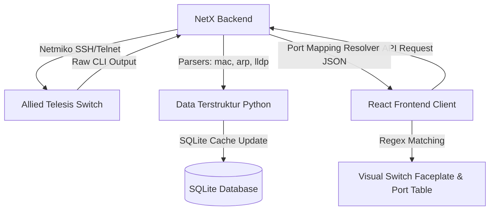

# Dokumentasi Teknis Integrasi Allied Telesis (AW+) pada NetX

Dokumentasi ini menjelaskan secara mendalam implementasi teknis untuk mengintegrasikan perangkat jaringan **Allied Telesis (AW+)** ke dalam sistem manajemen jaringan **NetX**. 

Integrasi ini mencakup penyempurnaan pada backend (konektivitas SSH/Telnet, pemrosesan teks CLI untuk tabel MAC, ARP, dan LLDP) serta pembaruan pada visualisasi visual port di frontend React.

---

## 1. Arsitektur Data & Alur Integrasi

Platform NetX mengumpulkan informasi topologi dan pemetaan port perangkat melalui alur berikut:



1. **Koneksi & Fetching (Connector)**: Backend menghubungi switch menggunakan library Netmiko (driver `allied_telesis_awplus`).
2. **Parsing CLI (Parsers)**: Output baris teks dari CLI diproses menggunakan regex dan tokenisasi khusus vendor.
3. **Database Caching (SQLite)**: Data hasil parsing disimpan ke dalam basis data sebagai cache untuk mempercepat respon.
4. **Port Mapping (API / Heuristic)**: Backend menggabungkan tabel MAC, ARP, dan LLDP untuk memetakan perangkat mana terhubung ke port mana.
5. **Rendering (Frontend)**: Data divisualisasikan dalam switch faceplate interaktif berdasarkan format nama port fisik.

---

## 2. Pembaruan dan Detail Modul Backend

### A. Modul Konektivitas (connector.py)
Modul ini bertanggung jawab untuk menginisialisasi sesi SSH/Telnet ke perangkat target.

* **Peta Perintah CLI**:
  Menambahkan konfigurasi khusus untuk tipe perangkat `"allied_telesis"` dan `"allied_telesis_awplus"` agar sistem mengetahui perintah yang harus dikirimkan:
  ```python
  ARP_COMMANDS["allied_telesis"] = "show arp"
  LLDP_COMMANDS["allied_telesis"] = ["show lldp neighbors", "show lldp neighbors detail"]
  ROUTING_COMMANDS["allied_telesis"] = "show ip route"
  INFO_COMMANDS["allied_telesis"] = ["show version", "show system"]
  INFO_COMMANDS["allied_telesis_awplus"] = ["show version", "show system"]
  MAC_TABLE_COMMANDS["allied_telesis"] = "show mac address-table"
  MAC_TABLE_COMMANDS["allied_telesis_awplus"] = "show mac address-table"
  ```
* **Pemetaan Driver Netmiko**:
  Netmiko menggunakan driver khusus bernama `allied_telesis_awplus`. Modul ini mengonversi alias `"allied_telesis"` menjadi `"allied_telesis_awplus"` secara dinamis sebelum koneksi dibuat:
  ```python
  def _build_netmiko_device(device: dict, password: str) -> dict:
      device_type = device["device_type"]
      if device_type == "allied_telesis":
          device_type = "allied_telesis_awplus"
      # ...
  ```

---

### B. Parser Tabel MAC (mac_parser.py)
Parser ini menangani output dari perintah `show mac address-table` pada Allied Telesis.

#### Format Output 1 (Standard):
```text
Vlan    Mac Address       Port       Type      Remaining Life
----    -----------       ----       ----      --------------
1       001a.eb12.3456    port1.0.1  dynamic   300
```

#### Format Output 2 (VLAN Forwarding Database):
```text
Vlan    Port       Mac Address       Type
----    ----       -----------       ----
1       port1.0.1  001a.eb12.3456    dynamic
```

#### Logika Parsing & Solusi:
1. **Penyaringan Header**:
   Menghindari baris pembatas (`----`), baris kosong, dan judul kolom menggunakan deteksi pola:
   ```python
   if not line_strip or "----" in line_strip or line_strip.lower().startswith("vlan port") or line_strip.lower().startswith("vlan   ") or ...:
       continue
   ```
2. **Deteksi Multi-Format**:
   Menggunakan ekspresi reguler `MAC_RE` untuk mendeteksi posisi kolom MAC Address.
   - Jika MAC Address berada di kolom ke-2 (index 1), parser membaca dengan urutan: **VLAN -> MAC -> PORT -> TYPE**.
   - Jika MAC Address berada di kolom ke-3 (index 2), parser membaca dengan urutan: **VLAN -> PORT -> MAC -> TYPE**.
3. **Normalisasi MAC**:
   Mengonversi format titik `001a.eb12.3456` menjadi format standar uppercase colon `00:1A:EB:12:34:56`.

---

### C. Parser Tabel ARP (arp_parser.py)
Parser ini menerjemahkan output `show arp` menjadi relasi IP, MAC, dan Port.

#### Format Output 1:
```text
IP Address      MAC Address       Port         Type      Age
192.168.1.1     001a.eb12.3456    port1.0.1    dynamic   12
```

#### Format Output 2 (Dengan VLAN Interface):
```text
IP Address      LL Address       Interface            Port        Type
10.101.50.1     80db.17cd.b100   vlan1150             port1.0.49  dynamic
```

#### Logika Parsing & Solusi:
* Menggunakan tokenisasi berbasis spasi (`line.strip().split()`).
* **Format 5 Token**: 
  Jika token terakhir (`tokens[4]`) berupa angka atau tanda hubung (`-`), maka kolom ke-3 adalah physical port dan kolom ke-5 adalah age.
  Jika token terakhir bukan angka, maka format tersebut menggunakan struktur 5 token ber-VLAN, di mana kolom ke-4 (`tokens[3]`) adalah physical port (`port1.0.49`) dan kolom ke-3 (`tokens[2]`) adalah VLAN virtual interface (`vlan1150`). Port fisik diprioritaskan untuk pemetaan di database.

---

### D. Parser LLDP (lldp_parser.py)
Menerjemahkan informasi tetangga (neighbors) dari perintah `show lldp neighbors detail`.

#### Format Detail Blok:
```text
Local port1.0.49:
  Chassis ID ....................... e030.f94d.9e78
  Port ID .......................... 629
  System Name ...................... Kementrian_LT1
  System Description ............... Allied Telesis Switch AW+
  Management Address ............... 10.101.50.1
```

#### Logika Parsing & Solusi:
1. **Pemisahan Blok**:
   Membagi output text menggunakan regular expression yang menangkap header blok `"Local [port]:"` atau `"LLDP detail information for port [port]"`:
   ```python
   blocks = re.split(r"(?:LLDP detail information for port\s+|Local\s+)(port\d+\.\d+\.\d+|[a-zA-Z\d\/\.\-]+):?\s*\n", output, flags=re.IGNORECASE)
   ```
2. **Pencarian Field dengan Pemisah Titik (`.`)**:
   Format Allied Telesis menggunakan titik penyeimbang (`Chassis ID ........ e030.f94d.9e78`). Regex parser dimodifikasi agar mendukung pemisah titik atau titik dua:
   ```python
   m = re.search(r"Chassis ID\s*(?:\.+|:)\s*([^\n]+)", block_text, re.IGNORECASE)
   ```
3. **Penyatuan Deskripsi Multi-baris**:
   Spesifikasi `"System Description"` seringkali memiliki nilai yang membentang ke baris baru dengan indentasi spasi. Parser melacak baris berikutnya dan menggabungkannya jika baris tersebut menjorok ke dalam (indentasi > 10 spasi) dan tidak mengandung field baru.
4. **Proteksi Pemotongan Port Fisik**:
   Secara global, parser LLDP memotong unit subinterface logical (seperti `ge-0/0/0.0` menjadi `ge-0/0/0`). Namun, format port Allied Telesis (`port1.0.49`) mengandung tanda titik yang bukan subinterface melainkan ID Switch, Slot, dan Port fisik.
   Kami menambahkan pengecualian khusus agar tidak melakukan pemotongan unit jika formatnya adalah `portX.Y.Z`:
   ```python
   is_allied = "allied" in device_type.lower()
   # ...
   if not (is_allied and re.match(r"^port\d+\.\d+\.\d+$", n["local_port"], re.IGNORECASE)):
       n["local_port"] = _clean_port(n["local_port"])
   ```

---

## 3. Pembaruan Frontend (PortMapper.jsx)

Modul React pada front-end memilah semua antarmuka yang diterima dari API ke dalam kategori **Fisik (Physical)** atau **Virtual/Manajemen**. Hanya port fisik yang akan digambar pada switch faceplate panel.

* **Penambahan Regex Port Fisik**:
  Menambahkan aturan deteksi port fisik agar mengenali format penamaan port Allied Telesis yang diawali dengan kata `port` diikuti dengan koordinat slot/port:
  ```javascript
  const isPhys = (
    name.includes('ethernet') || 
    name.includes('gi') || 
    // ... (vendor lain)
    /^port\d+\.\d+\.\d+/.test(name) ||  // Allied Telesis: port1.0.1, port1.0.49
    /^[a-z]+\d+\/\d+/.test(name)
  ) && !name.includes('port-channel') && !name.includes('virtual') ...
  ```
  Dengan perubahan ini, port Allied Telesis secara otomatis diklasifikasikan sebagai port fisik dan dirender di dalam visualisasi switch faceplate (terbagi rata secara ganjil di atas dan genap di bawah).

---

## 4. Validasi Basis Data & Verifikasi Lapangan

Untuk memastikan keakuratan integrasi, serangkaian uji coba sinkronisasi database telah dijalankan secara berurutan pada perangkat Allied Telesis (ID Perangkat: `51`):

1. **Uji Coba Ekstraksi (Raw to Struct)**:
   Backend berhasil mengekstrak data dari dump output mentah:
   - **Tabel MAC**: Terbaca **238 entri** secara dinamis.
   - **Tabel ARP**: Terbaca **1 entri** (IP `10.101.50.1` -> MAC `80:db:17:cd:b1:00` pada port `port1.0.49`).
   - **Tabel LLDP**: Terbaca tetangga **Kementrian_LT1** pada port `port1.0.49`.

2. **Sinkronisasi Database**:
   Jalur API backend dipicu untuk menulis data ke database SQLite lokal `netx.db`.
   
   *Hasil Query SQLite:*
   ```sql
   SELECT device_id, COUNT(*) FROM device_mac_cache WHERE device_id = 51;
   -- Hasil: 238 baris tersimpan
   
   SELECT device_id, neighbor_name, local_port FROM device_lldp_cache WHERE device_id = 51;
   -- Hasil: 51 | Kementrian_LT1 | port1.0.49
   ```

3. **Verifikasi Frontend Build**:
   Proses bundling frontend sukses (`npm run build`), menandakan tidak ada syntax error dalam modifikasi React.

---

## 5. Panduan Pemeliharaan (Maintenance Guide)

Jika di masa mendatang terjadi perubahan versi firmware Allied Telesis yang mengubah format CLI output, berikut adalah langkah pemecahan masalahnya:

1. **Simpan Output CLI Baru**:
   Jalankan perintah berikut pada switch dan simpan ke file teks:
   ```bash
   show mac address-table
   show arp
   show lldp neighbors detail
   ```
2. **Gunakan Script Verifikasi Mandiri**:
   Jalankan script test parser lokal yang ada di folder scratch untuk mencocokkan output mentah dengan regex yang ada di `mac_parser.py`, `arp_parser.py`, dan `lldp_parser.py`.
3. **Modifikasi Pola Regex**:
   Sesuaikan pola ekspresi reguler pada modul parser terkait jika terdapat penambahan spasi atau pergantian kata kunci kolom oleh vendor.

---

## 6. Layer 2 Monitoring (STP & VLAN) via SNMP

### A. Backend — SNMP L2 Status Endpoint (`/api/snmp/l2-status/{device_id}`)

Endpoint ini mengambil informasi Layer 2 perangkat secara real-time melalui SNMP, meliputi:

1. **STP Global Parameters**: Menggunakan `SNMP GET` pada OID `dot1dStp` (`.1.3.6.1.2.1.17.2`):
   - Protocol Spec (`.2.1.0`), Priority (`.2.2.0`), Root Bridge (`.2.5.0`), Root Cost (`.2.6.0`), Root Port (`.2.7.0`), Time Since Change (`.2.3.0`), Topology Changes (`.2.4.0`).
   - Root Bridge ID (8 oktet biner) diformat menjadi `priority / MAC`.

2. **STP Port States**: Menggunakan `SNMP WALK` pada:
   - `dot1dBasePortIfIndex` (`.1.3.6.1.2.1.17.1.4.1.2`) — pemetaan bridge port ke ifIndex.
   - `dot1dStpPortState` (`.1.3.6.1.2.1.17.2.15.1.3`) — status STP per port (disabled/blocking/listening/learning/forwarding/broken).
   - `dot1dStpPortPathCost` (`.1.3.6.1.2.1.17.2.15.1.5`) — path cost per port.
   - Port resolusi: bridge_port → ifIndex → ifName/ifDescr (nama fisik).

3. **VLAN Database**: Menggunakan `SNMP WALK` pada:
   - `dot1qVlanStaticName` (`.1.3.6.1.2.1.17.7.1.4.3.1.2`) — nama VLAN yang dikonfigurasi.

Semua query SNMP dijalankan secara paralel menggunakan `asyncio.gather()`.

### B. Frontend — Tab Layer 2 di DeviceDetail

Tab baru `⛓️ Layer 2 (STP/VLAN)` ditambahkan ke halaman detail perangkat, menampilkan:
- **STP Global Stat Cards**: Protocol, Priority, Root Bridge, Root Cost, Root Port, dan jumlah Topology Changes.
- **Tabel STP Port States**: Bridge Port, Interface Name, State (dengan badge warna: hijau=forwarding, merah=blocking, kuning=learning), dan Path Cost.
- **Tabel VLANs**: VLAN ID dan nama VLAN.

---

## 7. Penyempurnaan Syslog Viewer

### A. Backend — Senders Endpoint & Sender IP Tracking

1. **Kolom `sender_ip`**: Ditambahkan ke tabel `device_syslogs` untuk menyimpan IP pengirim asli dari paket UDP.
2. **Endpoint `/api/syslog/senders`**: Mengembalikan daftar perangkat yang pernah mengirim syslog, termasuk:
   - Device ID, nama, IP, jumlah log, dan waktu terakhir menerima log.
   - Mendukung pengelompokan perangkat yang belum terdaftar (`device_id IS NULL`).
3. **Filter `unregistered`**: Parameter `device_id` pada endpoint GET syslog sekarang menerima string `"unregistered"` untuk memfilter log dari perangkat yang tidak terdaftar.
4. **Pencarian diperluas**: Field `sender_ip` kini termasuk dalam pencarian full-text syslog.

### B. Syslog Server — Async Processing

Pemrosesan datagram syslog di-refaktor untuk menggunakan pola async:
- `datagram_received()` membuat `asyncio.create_task()` agar tidak memblokir event loop UDP.
- Operasi database dan anomaly analysis dijalankan melalui `loop.run_in_executor()`.

### C. Frontend — Tab Perangkat Terhubung

Tab baru `🔌 Perangkat Terhubung` ditambahkan ke SyslogViewer, menampilkan:
- Tabel daftar perangkat pengirim syslog (terdaftar vs. tidak terdaftar).
- Jumlah log dan waktu aktivitas terakhir per perangkat.
- Tombol "Lihat Log" yang otomatis memfilter tab Log Stream ke perangkat tersebut.
- Auto-refresh per tab (5 detik) mengikuti tab yang aktif.

---

## 8. Arsitektur Worker Process

Sistem NetX kini mendukung mode operasi terpisah:

- **Mode `unified`** (default): API dan background jobs berjalan dalam satu proses.
- **Mode `api`**: API-only, background jobs dinonaktifkan. Diatur via environment variable `NETX_MODE=api`.
- **Worker process** (`worker.py`): Menjalankan semua background jobs secara terpisah:
  - Device Backup Scheduler
  - Network History Tracker
  - Anomaly Detection Scheduler
  - Syslog UDP Server

`run.bat` dan `run_production.bat` diupdate untuk menjalankan worker di jendela terpisah dan API dalam mode `api`, menghindari duplikasi background tasks.

---

## 9. Refaktor Anomaly Detection Engine

Modul `anomaly_detector.py` di-refaktor secara menyeluruh:

1. **Helper SNMP Terdedikasi**: Fungsi `walk_oid()` dan `get_scalar_oid()` terpisah dengan error handling dan logging.
2. **Deteksi Storm**: Broadcast, Multicast, dan Unicast storm terdeteksi berdasarkan rate (pps) dengan threshold WARNING dan CRITICAL yang dikonfigurasi.
3. **Port Flapping via SNMP**: Perubahan status operasional interface dilacak dengan sliding window 5 menit.
4. **STP TCN via SNMP**: Perubahan counter `dot1dStpTopChanges` antar polling cycle memicu anomali.
5. **MAC Flapping**: Perpindahan MAC address antar perangkat/interface dalam waktu < 15 menit terdeteksi.
6. **Auto-Resolve**: Anomali transien (STP TCN, MAC Flapping) otomatis di-resolve setelah timeout.
7. **Concurrency Control**: Semaphore membatasi polling SNMP menjadi maksimal 3 perangkat paralel.
8. **Tabel Database Baru**:
   - `interface_stats_latest`: Menyimpan counter SNMP terakhir per interface untuk kalkulasi delta.
   - `mac_history_tracking`: Melacak lokasi terakhir setiap MAC address untuk deteksi perpindahan.
